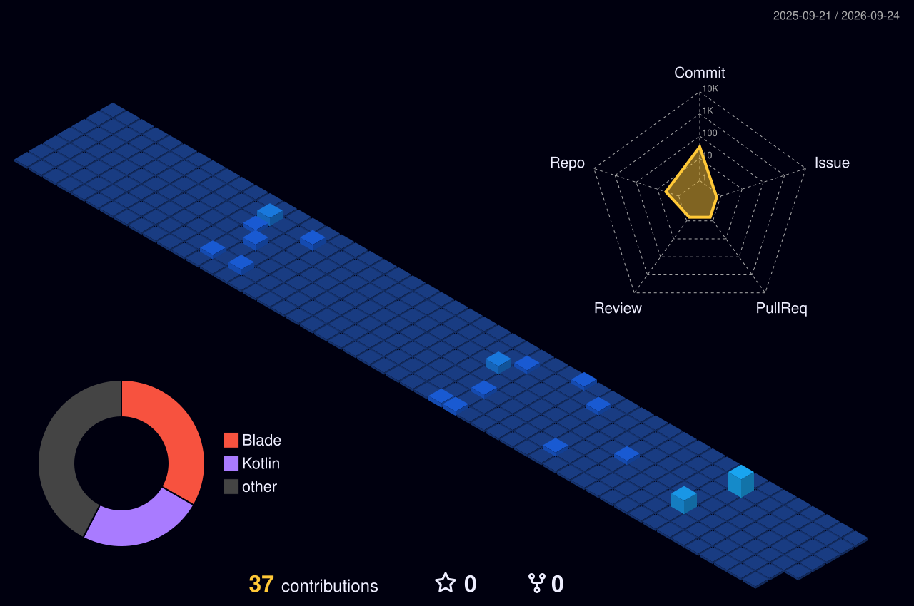

<!-- Animated gradient banner -->
<p align="center">
  
</p>

<!-- Animated typed text -->
<div align="center">
  
</div>

<!-- Visitor + social -->
<div align="center">
  <a href="https://github.com/RifkyDYanuar">
    
  </a>
  &nbsp;
  <a href="https://github.com/RifkyDYanuar?tab=followers">
    
  </a>
</div>

<p align="center">
  <a href="https://linkedin.com/in/rifky-dewani-yanuar" target="_blank"></a>
  <a href="https://github.com/RifkyDYanuar" target="_blank"></a>
  <a href="https://rifkydewaniyanuar.dev" target="_blank"></a>
  <a href="mailto:rifky@example.com"></a>
</p>

<div align="center">
  
  <h3>About Me</h3>
</div>

<table>
<tr>
<td width="50%" valign="top">

- 🔭 **Focus**: Building scalable APIs, intelligent systems, and Computer Vision solutions.
- 🌱 **Learning**: MLOps, Next.js, and mastering Android (Kotlin).
- 💼 **Current**: Working on my thesis and expanding my portfolio.
- 🎯 **Goal**: Ship software that people actually enjoy using and solves real problems.
- ⚡ **Fun Fact**: I debug complex code with the help of too much coffee ☕.

</td>
<td width="50%" valign="top">

```json
{
  "name": "Rifky Dewani Yanuar",
  "role": "Software Engineer",
  "location": "Indonesia",
  "skills": ["Laravel", "React", "Python"],
  "passions": ["AI", "Computer Vision", "Backend"]
}
```

</td>
</tr>
</table>

<br>

<div align="center">
  <h3>🛠 Tech Stack & Skills</h3>
</div>

<p align="center">
  <a href="https://skillicons.dev">
    
  </a>
</p>

<div align="center">
  <h3>🔥 GitHub Stats & Activity</h3>
</div>

<div align="center">
  
  
</div>

<div align="center">
  
</div>

<br>

<div align="center">
  
</div>

<br>

<div align="center">
  <h3>🐍 Contribution Graph</h3>
</div>

<!-- Animated Snake -->
<div align="center">
  <picture>
    <source media="(prefers-color-scheme: dark)" srcset="https://raw.githubusercontent.com/RifkyDYanuar/RifkyDYanuar/output/github-snake-dark.svg?v=1" />
    <source media="(prefers-color-scheme: light)" srcset="https://raw.githubusercontent.com/RifkyDYanuar/RifkyDYanuar/output/github-snake.svg?v=1" />
    
  </picture>
</div>

<br>

<div align="center">
  <h3>🏆 3D Contribution Graph</h3>
</div>

<div align="center">
  
</div>

<br>

<div align="center">
  <h3>🤝 Support & Connect</h3>
  <p>If you find my work useful, consider supporting me! It helps me keep creating open-source projects.</p>
  <a href="https://www.buymeacoffee.com/rifkydyanuar" target="_blank"></a>
</div>

<br>

<div align="center">
  <h3>🌟 Daily Motivation</h3>
  
</div>

<!-- Footer wave -->
<p align="center">
  
</p>
